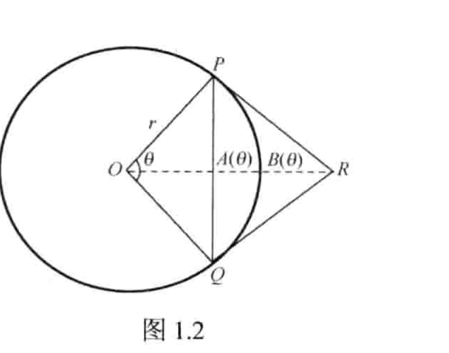

## 题面

如图 1.2 所示，弦 $PQ$ 所对的圆心角为 $\theta$。设 $A(\theta)$ 是弦 $PQ$ 与弧 $PQ$ 之间的面积，$B(\theta)$ 是切线长 $PR$、$QR$ 与弧之间的面积，求极限

$$
\lim_{\theta\to0^+}\frac{A(\theta)}{B(\theta)}.
$$

来源：主线教材 PDF 第 33–36 页（印刷页 26–29）。

> [!solution]- 题解（点击展开）
>
> 题解暂未整理。当前页面只确认题面，不填入未经复核的结论。

## 导航

本节：　[[数理漫游/思题海洋/01-蒲和平教程/01-第一章/02-第二节/16-题目|← 上一题]] · [[数理漫游/思题海洋/01-蒲和平教程/01-第一章/02-第二节/18-题目|下一题 →]]

小节：　[[数理漫游/思题海洋/01-蒲和平教程/01-第一章/02-第二节|本节目录]] · [[数理漫游/思题海洋/01-蒲和平教程/01-第一章/01-第一节|上一节]] · [[数理漫游/思题海洋/01-蒲和平教程/01-第一章/03-第三节|下一节]]

章节：　[[数理漫游/思题海洋/01-蒲和平教程/01-第一章|本章目录]] · [[数理漫游/思题海洋/01-蒲和平教程/02-第二章|下一章]]

资料：　[[数理漫游/思题海洋/01-蒲和平教程|资料目录]] · [[数理漫游/思题海洋|思题海洋总目录]]
